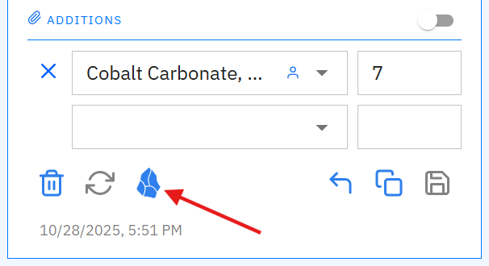
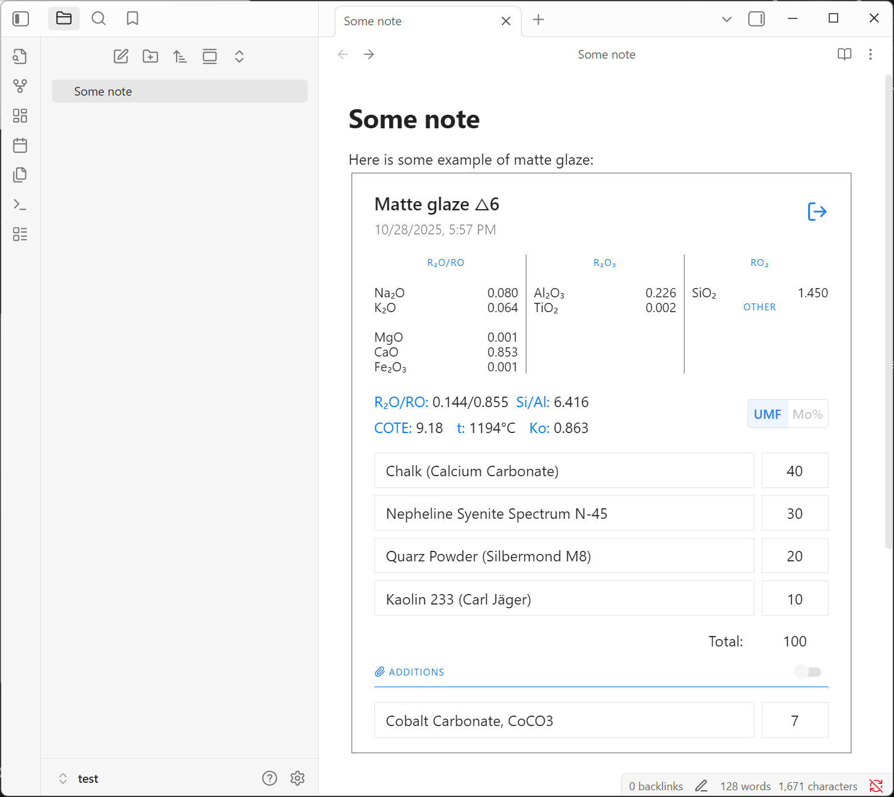

# Segerlab Plugin for Obsidian

A plugin that brings calculation views from segerlab into your Obsidian notes.

## Features

- **Calculator Rendering**: Transforms markdown code blocks with language `segerlab-calculation` into interactive calculator views
- **Extended Coefficients**: Optional setting to display additional coefficients in the calculator interface
- **Multi-language Support**: Interface available in English and Russian, automatically adapts to your Obsidian language setting

## Installation

### From Community Plugins _(not available yet)_
1. Open Obsidian Settings
2. Go to Community Plugins
3. Search for "Segerlab"
4. Install and enable the plugin

### Manual Installation
1. Download the latest release from the [releases page](https://github.com/ksemkav/obsidian-segerlab-plugin/releases)
2. Extract the files to your vault's `.obsidian/plugins/segerlab/` directory
3. Enable the plugin in Obsidian settings

## Usage

1. Open some recipe in segerlab and find a calculator you want to see in your Obsidian note.
1. Click to the button with Obsidian logo. It will copy current state of the calculator into clipboard.

	 
	 
1. Paste the clipboard content into your Obsidian note. After moving cursor out of the code block, it will be rendered as a calculator.
	 
### Example:

