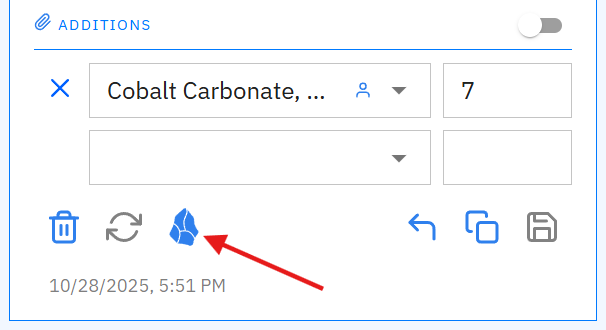
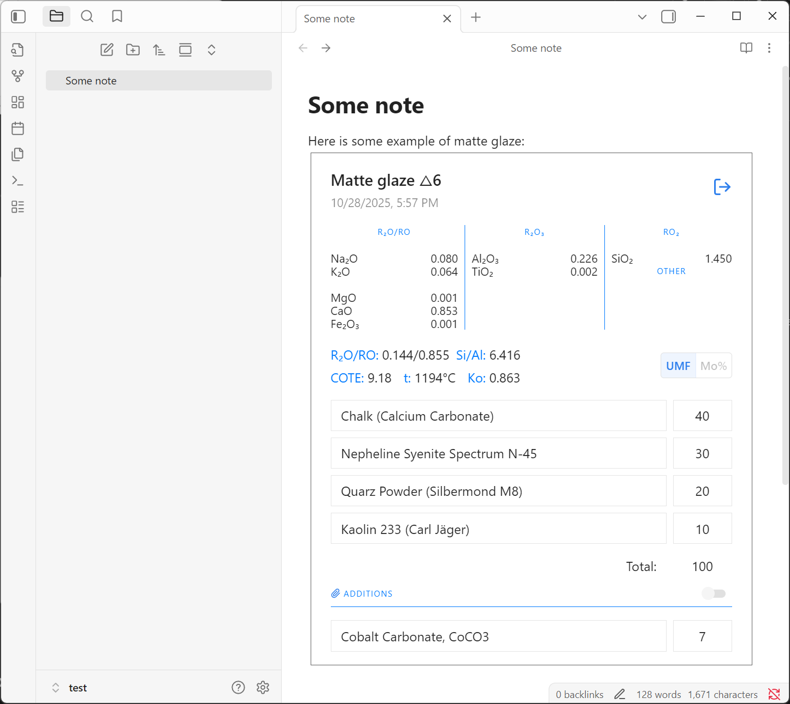

# Segerlab плагин для Obsidian

[Segerlab](https://segerlab.ru) — это записная книжка для керамистов и гончаров, которые делают собственные глазури.

Этот плагин позволяет отображать калькуляторы в привычном виде прямо в ваших заметках Obsidian.

## Функционал

- **Отображение калькуляторов**: Трансформирует markdown блоки, помеченные как `segerlab-calculation`, в калькуляторы
- **Больше коэффициентов**: Такая же опция «Отображать больше коэффициентов в калькуляторе», чтобы показывать больше расчтёных коэффициентов в калькуляторе.
- **Поддержка разных языков**: Интерфейс калькулятора доступен как на русском, так и на английском языках. Зависит от языковых настроек Obsidian.
- **График Сталла**: Панель с графиком Сталла с точками-калькуляторами, найденными в открытой заметке.
- **Поиск по заметкам**: Настройте свой шаблон поискового запроса для поиска рецептов или калькуляторов по заметкам. Поиск открывается при нажатии на кнопку Obsidian в рецепте в Segerlab.

## Установка

### Включите настройку «Я использую Obsidian» в Segerlab
Чтобы видеть кнопки Obsidian в калькуляторах и рецептах, включите соответствующую настройку на странице «[Мой профиль](https://segerlab.ru/profile)» (нажмите на иконку шестерёнки в левом нижнем углу).

### Установка плагина из списка «Плагины сообщества» _(пока недоступно)_
1. Откройте настройки Obsidian
2. Перейдите в раздел «Плагины сообщества»
3. Найдите плагин «Segerlab»
4. Установите и включите плагин

### Ручная установка
1. Скачайте файлы `main.js`, `styles.js` и `manifest.json` из последнего релиза плагина на [Github](https://github.com/ksemkav/obsidian-segerlab-plugin/releases)
2. Создайте папку `.obsidian/plugins/segerlab/` в папке с вашим хранилищем заметок Obsidian, если её ещё нет и скопируйте туда скачанные файлы
3. Откройте настройки, перейдите в раздел «Сторонние плагины» → «Управление плагинами» и включите плагин «Segerlab»
4. Если хотите видеть все расчётные коэффициенты в калькуляторе, перейдите в настройки плагина и включите опцию «Показывать больше коэффициентов в калькуляторе»

### Настройки плагина
- **Отображать больше коэффициентов в калькуляторе**: Включите эту опцию, чтобы показывать дополнительные коэффициенты в калькуляторах.
- **Шаблон поискового запроса**: Настройте шаблон вашего поискового запроса для поиска рецептов или калькуляторов в ваших заметках. Есть несколько примеров, которые можно скопировать и использовать.

## Использование

### Копирование калькулятора из Segerlab в Obsidian

1. Откройте какой-нибудь рецепт в Segerlab и найдите калькулятор, который хотите видеть в вашей заметке.
2. Нажмите кнопку с логотипом Obsidian. Это скопирует текущее состояние калькулятора в буфер обмена.

	  
3. Вставьте содержимое буфера обмена в вашу заметку. После того как вы переместите курсор за пределы блока кода, он будет отображён как калькулятор.

### Поиск использования калькуляторов из рецепта по заметкам

1. В заголовке рецепта нажмите на кнопку с логотипом Obsidian.

   
2. Откроется ваша база заметок с результатами поиска всех заметок, согласно шаблону поискового запроса, настроенному в параметрах плагина. (По-умолчанию ищутся все заметки, содержащие калькуляторы из данного рецепта).
   
   


### Пример отображения калькулятора и графика Сталла:

Плагин использует цвета из текущей темы, поэтому внешний вид поддерживает тёмный и светлый режимы.



#### Пример содержимого блока кода, скопированного калькулятора:

````markdown
```segerlab-calculator
{
  "recipeId": 8345,
  "calculationId": 36955,
  "name": "Matte glaze △6",
  "formulaViewType": "SegerFormula",
  "includeAdditionsIntoCalculations": false,
  "versionCreatedAt": "2025-10-28T17:57:40+01:00",
  "ingredients": [
    {
      "name": "Chalk (Calcium Carbonate)",
      "value": 40,
      "isAddition": false,
      "index": 0
    },
    {
      "name": "Nepheline Syenite Spectrum N-45",
      "value": 30,
      "isAddition": false,
      "index": 1
    },
    {
      "name": "Quarz Powder (Silbermond M8)",
      "value": 20,
      "isAddition": false,
      "index": 2
    },
    {
      "name": "Kaolin 233 (Carl Jäger)",
      "value": 10,
      "isAddition": false,
      "index": 3
    },
    {
      "name": "Cobalt Carbonate, CoCO3",
      "value": 7,
      "isAddition": true,
      "index": 4
    }
  ],
  "calculationResult": {
    "formula": {
      "GFormers": {
        "SiO2": 1.45
      },
      "Stabs": {
        "Al2O3": 0.226,
        "TiO2": 0.002
      },
      "Alcali": {
        "Na2O": 0.08,
        "K2O": 0.064
      },
      "AEarth": {
        "MgO": 0.001,
        "CaO": 0.853,
        "Fe2O3": 0.001
      }
    },
    "stullChartPoint": {
      "al2O3Value": 0.226,
      "siO2Value": 1.45
    },
    "ingredientsOverallSum": 100,
    "alcaliSum": 0.144,
    "aEarthSum": 0.855,
    "siliconAluminumOxidesRatio": 6.416,
    "molarThermalExpansion": 9.11,
    "molecularMassThermalExpansion": 9.18,
    "calculatedFluxibility": {
      "temperature": 1194,
      "coefficient": 0.306,
      "temperatureZone": "Within"
    },
    "acidityRatio": 0.863
  }
}
```
````
